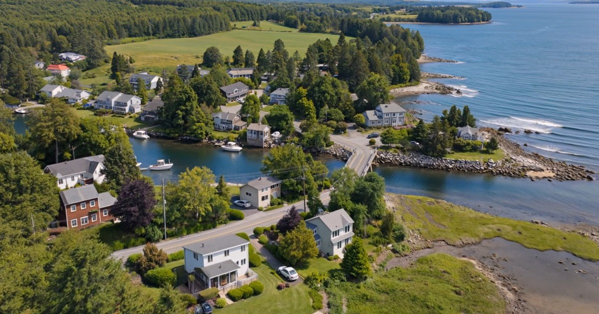

# Coastal Scene: 100 images for annotation practice

100 image entries from one coastal recording, each 1820 x 1136 pixels.
There are 92 unique image files by SHA-256: eight entries repeat a frame exactly.
The original 100-entry selection is retained to match the video. Adjacent frames are correlated.
The image owner authorized redistribution with credit and a link to AnnotateIt on 2026-09-30.

## Attribution and license

Coastal Scene by AnnotateIt — https://annotateit.ai/datasets/coastal-scene/ — CC BY 4.0 (https://creativecommons.org/licenses/by/4.0/). Indicate any changes you make.

Images and AnnotateIt's accompanying dataset documentation are licensed under CC BY 4.0.
This is not a license for model weights, third-party software, or the AnnotateIt application.

## Download version 1

- [AnnotateIt starter project](https://models.annotateit.ai/v2/samples/coastal-scene-v1/coastal-scene-starter-v1.zip)
- [Original JPEG images](https://models.annotateit.ai/v2/samples/coastal-scene-v1/coastal-scene-images-v1.zip)
- [Comparison evidence](https://models.annotateit.ai/v2/samples/coastal-scene-v1/coastal-scene-comparison-evidence-v1.zip)
- [GitHub release and mirrors](https://github.com/yvolokitin/annotateit-demo-datasets/releases/tag/coastal-scene-v1)

## Files

- coastal-scene-starter-v1.zip: AnnotateIt project, 100 images, no labels or annotations.
- coastal-scene-images-v1.zip: the same unmodified images with ordinary .jpg filenames.
- coastal-scene-comparison-evidence-v1.zip: three source frames, saved model polygon coordinates,
  original preview SVGs, rendered comparison panels and settings from the recorded experiment.
  This is a diagnostic evidence pack, not an importable labeled project or a COCO export.

Import the starter through Create from exported project. Use Auto-label to discover supported
classes, or add car and boat for the two-class AI workflow. The Windows manual guide instead
uses building, boat, car, bridge and seawall.

## What this release does not contain

The video records 757 RF-DETR draft annotations across 100 frames. This release does not contain
that complete batch export. The archived comparison has three frames per model; its local
preview SVGs do not retain class assignments or confidence scores. Coordinates are provided
without inventing those missing fields. No annotations are certified as human-reviewed ground truth.

The frames are highly correlated. Do not use a random split of these frames to claim independent
model evaluation. Use separate recordings or locations for held-out evaluation.

## Settings

ECSeg-M, ECSeg-X and RF-DETR-Seg-2XL: preview confidence 0.40.
Additional RF-DETR preview: 0.25. The recorded batch applied an additional 0.50 output filter.
ChatGPT: GPT-6-Astra, car/boat labels, 32 draft polygons across three frames.
Hardware, historical app/runtime versions and weight hashes were not captured together.
The material supports visual inspection of this run, not a reproducible accuracy benchmark.

## Read and watch

- Dataset: https://annotateit.ai/datasets/coastal-scene/
- Comparison: https://annotateit.ai/ai-image-annotation-model-comparison/
- Windows guide: https://annotateit.ai/annotate-100-images-on-windows/
- Full video: https://youtu.be/wixgwmg3O00

Checksums are in SHA256SUMS.txt. Version 1.0.0, released 2026-09-30.
